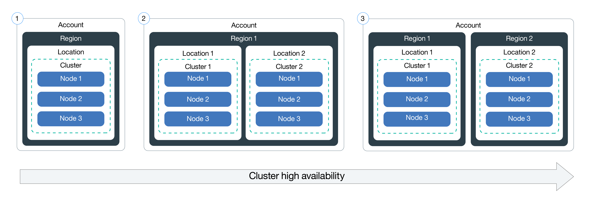

# Lab 2) Deployment のスケーリングとアップデート

Lab2では，Deploymentのインスタンス数を増減させるスケーリングと，安全にロールアウトさせながらアプリケーションをアップデートする方法を学びます。 

Lab2を実施するには，`guestbook` アプリケーションのDeploymentが動作している必要があります。以下の手順で `Deployment` や `Service` をデプロイしてください。

実行例:

```bash
$ kubectl run guestbook --image=ibmcom/guestbook:v1
$ kubectl expose deployment guestbook --type="NodePort" --port=3000
```

## 1. レプリカ数(replica)の指定によるアプリケーションのスケーリング
同じアプリケーションが動作するPodを複数稼働させることによって負荷増大や，障害に対しての可用性を高めることができます。Kubernetesでは `ReplicaSet` を使用することで，Pod(Deployment)を簡単に複製できます。

1. `kubectl` CLI は `scale` というサブコマンドを提供しています。既存のDeployment数を変更するために使用します。現在は1インスタンスで動作している `guestbook` を 10インスタンスで動作するように複製します。

    実行例:

    ```bash
    $ kubectl scale --replicas=10 deployment guestbook
    deployment.extensions/guestbook scaled
    ```

   >補足:  
   > Kubernetesのコントローラは，宣言された値(`--replicas=10`)を満たすように現在の状態をアップデートしようと働きかけます。今回のケースでは，既に1つのインスタンスが動作しているため，9つの新しいPodを作成することで，`desired state (今回は10)` を満たすように動作します。

2. スケーリング(ロールアウト)していく様子を以下のコマンドで確認します。

    `kubectl rollout status deployment guestbook`

    実行例:

    ```bash
    $ kubectl rollout status deployment guestbook
    Waiting for deployment "guestbook" rollout to finish: 1 of 10 updated replicas are available...
    Waiting for deployment "guestbook" rollout to finish: 2 of 10 updated replicas are available...
    Waiting for deployment "guestbook" rollout to finish: 3 of 10 updated replicas are available...
    Waiting for deployment "guestbook" rollout to finish: 4 of 10 updated replicas are available...
    Waiting for deployment "guestbook" rollout to finish: 5 of 10 updated replicas are available...
    Waiting for deployment "guestbook" rollout to finish: 6 of 10 updated replicas are available...
    Waiting for deployment "guestbook" rollout to finish: 7 of 10 updated replicas are available...
    Waiting for deployment "guestbook" rollout to finish: 8 of 10 updated replicas are available...
    Waiting for deployment "guestbook" rollout to finish: 9 of 10 updated replicas are available...
    deployment "guestbook" successfully rolled out
    ```

3. Podの動作状況を次のコマンドで確認します。

    `kubectl get pods`

    実行例:

    ```bash
    $ kubectl get pods
    NAME                         READY   STATUS    RESTARTS   AGE
    guestbook-75786d799f-4dj4q   1/1     Running   0          3m
    guestbook-75786d799f-6bcbm   1/1     Running   0          3m
    guestbook-75786d799f-6tfrt   1/1     Running   0          3m
    guestbook-75786d799f-7lh95   1/1     Running   0          3m
    guestbook-75786d799f-8qf56   1/1     Running   0          5m
    guestbook-75786d799f-hrw2v   1/1     Running   0          3m
    guestbook-75786d799f-lb9r2   1/1     Running   0          3m
    guestbook-75786d799f-mf5x9   1/1     Running   0          3m
    guestbook-75786d799f-n5tw5   1/1     Running   0          3m
    guestbook-75786d799f-x22sx   1/1     Running   0          3m
    ```

    >補足:  
    > 可用性を向上させるもう一つの方法
    > [add clusters and regions](https://console.bluemix.net/docs/containers/cs_planning.html#cs_planning_cluster_config)
    > 同一データセンター内で複数クラスターにする方法があります。複数のデータセンターに同一K8sクラスターを動作させることでより高可用にできます。
    > 
    > 

# 2. アプリケーションのアップデートとロールバック
Kubernetesは，アプリケーションを新しいコンテナイメージにローリングアップデートする機能を提供します。これは動作中のコンテナイメージを容易にアップデート，または問題が起きた際には容易にロールバックできるようにします。

以前のハンズオン(Lab1)では `v1` タグが付与されたイメージを使用していました。アップグレードを実施する際には， `v2` タグが付与されたイメージを使用します。

アップデートおよびロールバック:
1. `kubectl` コマンドで， `v2` イメージを使用するように Deploymentをアップデートすることができます。`kubectl` コマンドと `set` サブコマンドを使用します。

    ```$ kubectl set image deployment/guestbook guestbook=ibmcom/guestbook:v2```

   ※1つのPodは，複数のコンテナで構成することが可能です。各々固有の名前を持っており，その名前を使用することによって個別にイメージを変更したり，一度に全てのコンテナイメージを変更させることも可能です。
   `guestbook` のDeploymentにおけるコンテナ名は，`guestbook` です。

    複数コンテナを同時にアップデート 
    ([More information](https://kubernetes.io/docs/user-guide/kubectl/kubectl_set_image/).)

2. `kubectl rollout status deployment/guestbook` を実行することで，ロールアウトのステータスを確認できます。
    
    ※処理が早く完了した場合，以下のメッセージが表示されない場合があります

   ```console
   $ kubectl rollout status deployment/guestbook
   Waiting for rollout to finish: 2 out of 10 new replicas have been updated...
   Waiting for rollout to finish: 3 out of 10 new replicas have been updated...
   Waiting for rollout to finish: 3 out of 10 new replicas have been updated...
   Waiting for rollout to finish: 3 out of 10 new replicas have been updated...
   Waiting for rollout to finish: 4 out of 10 new replicas have been updated...
   Waiting for rollout to finish: 4 out of 10 new replicas have been updated...
   Waiting for rollout to finish: 4 out of 10 new replicas have been updated...
   Waiting for rollout to finish: 4 out of 10 new replicas have been updated...
   Waiting for rollout to finish: 4 out of 10 new replicas have been updated...
   Waiting for rollout to finish: 5 out of 10 new replicas have been updated...
   Waiting for rollout to finish: 5 out of 10 new replicas have been updated...
   Waiting for rollout to finish: 5 out of 10 new replicas have been updated...
   Waiting for rollout to finish: 6 out of 10 new replicas have been updated...
   Waiting for rollout to finish: 6 out of 10 new replicas have been updated...
   Waiting for rollout to finish: 6 out of 10 new replicas have been updated...
   Waiting for rollout to finish: 7 out of 10 new replicas have been updated...
   Waiting for rollout to finish: 7 out of 10 new replicas have been updated...
   Waiting for rollout to finish: 7 out of 10 new replicas have been updated...
   Waiting for rollout to finish: 7 out of 10 new replicas have been updated...
   Waiting for rollout to finish: 8 out of 10 new replicas have been updated...
   Waiting for rollout to finish: 8 out of 10 new replicas have been updated...
   Waiting for rollout to finish: 8 out of 10 new replicas have been updated...
   Waiting for rollout to finish: 8 out of 10 new replicas have been updated...
   Waiting for rollout to finish: 9 out of 10 new replicas have been updated...
   Waiting for rollout to finish: 9 out of 10 new replicas have been updated...
   Waiting for rollout to finish: 9 out of 10 new replicas have been updated...
   Waiting for rollout to finish: 1 old replicas are pending termination...
   Waiting for rollout to finish: 1 old replicas are pending termination...
   Waiting for rollout to finish: 1 old replicas are pending termination...
   Waiting for rollout to finish: 9 of 10 updated replicas are available...
   Waiting for rollout to finish: 9 of 10 updated replicas are available...
   Waiting for rollout to finish: 9 of 10 updated replicas are available...
   deployment "guestbook" successfully rolled out
   ```

3. ブラウザ上で `<public-ip>:<nodeport>` を指定して，アプリケーション動作を確認します。

   "nodeport" および "public-ip" は以下の方法で取得できます。

   `$ kubectl describe service guestbook`
   および
   `$ ibmcloud cs workers <name-of-cluster>`

   guestbook アプリの "v2" が動作していることを確認してください。ページタイトルの文字列が `Guestbook - v2` に変更されているはずです。

4. 最新のロールアウトに戻したい場合は以下を実行します。

   ```console
   $ kubectl rollout undo deployment guestbook
   deployment "guestbook"
   ```

   実行状況を確認する場合は， `$ kubectl rollout status deployment/guestbook` で確認できます。
   
5. ロールアウト実行する際，*古い* レプリカと，*新しい* レプリカを確認できます。
   古いレプリカは，10のPodとしてデプロイされています。(Lab2で1から10に増加させました)
   新しいレプリカは，異なるイメージを使用して新たに生成されました。
   これらの全てのPodは，Deploymentが所有します。
   Deploymentは，これらの2セットのPod群を ReplicaSetと呼ばれるリソースを使用して管理しています。
   
   guestbookのReplicaSetは以下のようにして確認できます。
   
   ```console
   $ kubectl get replicasets -l run=guestbook
   NAME                   DESIRED   CURRENT   READY     AGE
   guestbook-5f5548d4f    10        10        10        21m
   guestbook-768cc55c78   0         0         0         3h
   ```

おめでとうございます。第2段階のバージョンのアプリケーションのデプロイが完了しました。
次のハンズオンはこちら [Lab3](../Lab3/README.md) です。

Lab3を開始する前に，Lab2で作成したK8sコンテンツを削除してください。以下のコマンドを実行します。

  1. Deploymentを削除する `$ kubectl delete deployment guestbook`.

  2. Serviceを削除する `$ kubectl delete service guestbook`.
  
