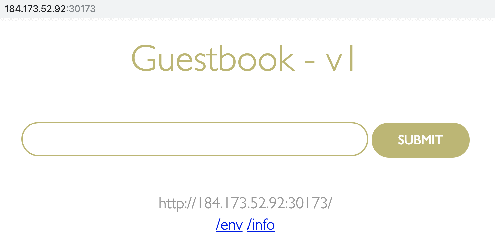
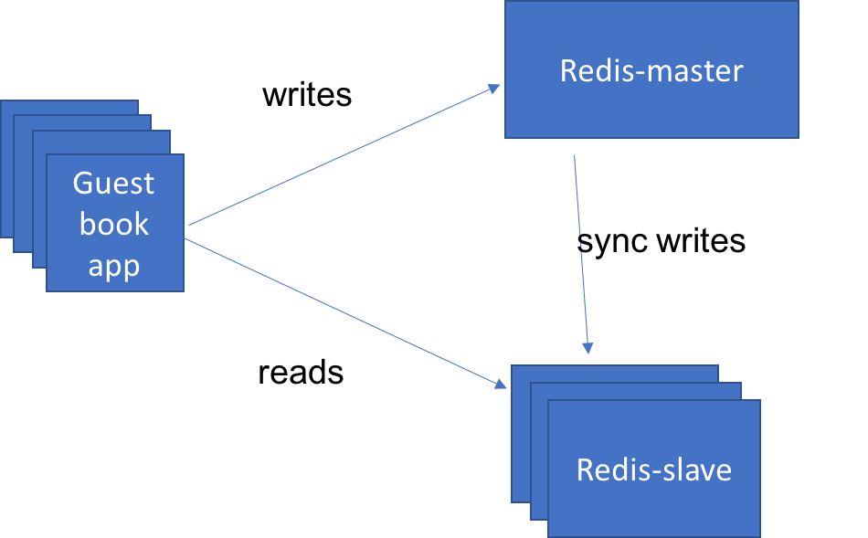

# Lab 3) マニフェストファイルを使用したスケーリングおよびアップデート
Lab 1，2で使用してきた`guestbook`アプリケーションと同じものを使用します。
これまでとの違いは，`kubectl run`コマンドなどで直接Podを作成・開始するのではなく，マニフェストファイル(構成ファイル)を使用してアプリケーションのデプロイを行う点です。

Kubernetesのコントローラーがマニフェストファイルの記述内容のステート(状態)に寄せていく「**宣言的** かつ，よりきめ細やかなりソース管理」をシンプルに実現できます。これがKubernetesを利用する最大の理由と言っても過言ではありません。

Lab 3では大きく以下の2つを体験します。

- **1. マニフェストファイルを使用したアプリケーションのスケーリング**
- **2. Redisコンテナを追加起動してguestbookアプリケーションと連携**

## 0. 事前準備 (リポジトリのクローン)
まずはアプリケーションをGitHubからクローンして，該当ディレクトリに移動してください。
複数バージョンのguestbookアプリケーションをKubernetes上にデプロイするためのマニフェストファイル(yaml)を配置しています。

```bash
マニフェストファイル群が用意されているリポジトリのクローンと，ディレクトリ移動

$ git clone https://github.com/capsmalt/guestbook.git
$ cd guestbook/v1
```

## 1. マニフェストファイルを使用したアプリケーションのスケーリング
ここで実施する作業自体は3ステップです。

- `guestbook-deployment.yaml` を使って `guestbook-v1`という名前のdeploymentを作成する (replicas=3 指定済)
- `guestbook-deployment.yaml` を編集して `3台構成`から`5台構成`にスケーリングさせる
- `guestbook-service.yaml` を使って `guestbook` という名前のserviceを作成する


上記自体は，コマンドを数回叩けば終わります。
この章では，yamlファイルの中身について目を通して，マニフェストファイルがどんなものか理解してください。

### まずは，guestbookアプリケーションのdeploymentの構成を見てみましょう。

1. **guestbook/v1/guestbook-deployment.yaml**  を任意のエディタで開きます。  


  ```yaml
  apiVersion: apps/v1
  kind: Deployment
  metadata:
    name: guestbook-v1
    labels:
      app: guestbook
      version: "1.0"
  spec:
    replicas: 3
    selector:
      matchLabels:
        app: guestbook
    template:
      metadata:
        labels:
          app: guestbook
          version: "1.0"
      spec:
        containers:
        - name: guestbook
          image: ibmcom/guestbook:v1
          ports:
          - name: http-server
            containerPort: 3000
  ```

  上記の構成ファイルは，`guestbook-v1`という名前のdeploymentオブジェクトを作成します。同時に`ibmcom/guestbook:v1`イメージを動作させる1つのコンテナを含むPodを作成します。この構成ファイルによって，`replicas: 3` と指定されるため，Kubernetesは少なくとも3つのアクティブなPodが動作し続けるように試みます。

  >補足:  
  > Kubernetesオブジェクトを作成する際には，yaml内で`apiVersion`や`kind`，`metadata`，`name`，`labels`，`namespace`などを指定できます。今回のようにdeploymentオブジェクトを生成する際は`kind: Deployment`のように指定します。他にも`Service`や`Pod`，`ConfigMap`，その他Kubernetesリソースの種類を指定することでマニフェストファイルから各種オブジェクトを作成できます。Deployment定義の場合は，`spec: `にレプリカ数や，使用するコンテナイメージ，ポートなどを指定しています。


2. guestbookのdeploymentオブジェクトの作成します。  

  マニフェストファイルを使用してdeploymentをします。

  実行例:

  ```bash
  $ kubectl create -f guestbook-deployment.yaml
  deployment.apps/guestbook-v1 created
  ```

3. ラベル(`label`)が `app=guestbook` であるPod一覧を表示します。  
  生成済の全てのPodの中から，labelが "app" で，その値が "guestbook" であるPodを一覧表示することが可能です。
  labelは，マニフェストファイル(yaml)内の `spec.template.metadata.labels` という項目の値を指します。

  実行例:

  ```bash
  $ kubectl get pods -l app=guestbook
  NAME                           READY   STATUS    RESTARTS   AGE
  guestbook-v1-7fc76dc46-dcjwg   1/1     Running   0          18m
  guestbook-v1-7fc76dc46-f7tzx   1/1     Running   0          18m
  guestbook-v1-7fc76dc46-zgckk   1/1     Running   0          18m
  ```

### マニフェストファイルのレプリカ数を編集してPodをスケーリングさせてみましょう。

4. マニフェストファイルを変更してみましょう。

  **guestbook/v1/guestbook-deployment.yaml** を任意のエディタで開いて `spec.replicas` の値を `replicas: 5` に変更します。

  ```yaml
  spec:
    replicas: 5
    selector:
      matchLabels:
        app: guestbook
  ```

5. 変更を反映させます。

  実行例:

  ```bash
  $ kubectl apply -f guestbook-deployment.yaml
  Warning: kubectl apply should be used on resource created by either kubectl create --save-config or kubectl apply
  deployment.apps/guestbook-v1 configured
  ```
6. 再度，Pod一覧を表示します。

  実行例:

  ```bash
  $ kubectl get pods -l app=guestbook
  NAME                           READY   STATUS    RESTARTS   AGE
  guestbook-v1-7fc76dc46-592gm   1/1     Running   0          1m
  guestbook-v1-7fc76dc46-dcjwg   1/1     Running   0          26m
  guestbook-v1-7fc76dc46-f7tzx   1/1     Running   0          26m
  guestbook-v1-7fc76dc46-k7nnq   1/1     Running   0          1m
  guestbook-v1-7fc76dc46-zgckk   1/1     Running   0          26m
  ```

  >補足1:  
  > マニフェストファイルを使用してdeploymentオブジェクトを生成することができました。今回はレプリカ数を増加させる変更を行いましたが，マニフェストファイル自体をバージョン管理することで，ある時点での状態をいつでも再現できることが分かるかと思います。Kubernetesでは基本的には全てのK8sリソースをマニフェストファイルを使用することで管理できます。一方で，各K8sリソースタイプごとに管理していくことの複雑さや手間の問題も指摘されています。この問題の解決策としてHelmやKustomize，Kssonetなど様々なツールを活用している事例もありますので，興味のある方はぜひ調査してみてください。
  > 
  >補足2:  
  > `kubectl edit` で直接編集することもできます。
  > ```bash
  > $ kubectl edit deployment guestbook-v1
  > 
  > "replicas: 3" のように変更しても良いです。
  > 未編集の場合は，":q"で終了。
  > 変更を加えた場合は，":wq"で保存するか，":q!"で変更をキャンセルします。
  > ```
  > 変更している場合は， `$ kubectl get pods -l app=guestbook` で確認してみましょう。
  > K8sが状態変更を適用させるべく，Podのインスタンスを増減させている様子が見れるはずです。
  > 
  > 実行例:
  > ```bash
  > $ kubectl get pods -l app=guestbook
  > NAME                           READY   STATUS        RESTARTS   AGE
  > guestbook-v1-7fc76dc46-592gm   0/1     Terminating   0          3m
  > guestbook-v1-7fc76dc46-dcjwg   1/1     Running       0          28m
  > guestbook-v1-7fc76dc46-f7tzx   1/1     Running       0          28m
  > guestbook-v1-7fc76dc46-k7nnq   0/1     Terminating   0          3m
  > guestbook-v1-7fc76dc46-zgckk   1/1     Running       0          28m
  > 
  > 少しだけ間を置いてから再度実行します。
  > 
  > $ kubectl get pods -l app=guestbook
  > NAME                           READY   STATUS    RESTARTS   AGE
  > guestbook-v1-7fc76dc46-dcjwg   1/1     Running   0          29m
  > guestbook-v1-7fc76dc46-f7tzx   1/1     Running   0          29m
  > guestbook-v1-7fc76dc46-zgckk   1/1     Running   0          29m
  > ```
  > 上記の例のようにレプリカ数3の状態になったことが確認できるはずです。


### 次に，guestbokアプリケーションのserviceの構成を見てみましょう。

7. **guestbook/v1/guestbook-service.yaml**  を任意のエディタで開きます。  

  ```yaml
  apiVersion: v1
  kind: Service
  metadata:
    name: guestbook
    labels:
      app: guestbook
  spec:
    ports:
    - port: 3000
      targetPort: http-server
    selector:
      app: guestbook
    type: NodePort
  ```

上記の構成では，`guestbook`という名前のserviceオブジェクトを作成します。Serviceはアプリケーションに対するトラフィックのためのネットワークパスを作成する際に使われます。今回はクラスター上の`3000番ポート`からのルートをアプリケーションの `http-serverポート` に指定します。

8. `guestbook-v1`deploymentを作成した時と同じコマンドを使って，`guestbook-service`serviceを作成しましょう。

  実行例:

  ```bash
  $ kubectl create -f guestbook-service.yaml
  service/guestbook created
  ```
  
9. ブラウザ上で以下のURLからgurstbookアプリの動作をテストします

    ブラウザで`<Public IP>:<NodePort>`を開きます。
    
    >補足:  
    > ワーカーノードの `Public IP` は以下のように確認します。
    > ```
    > $ ibmcloud cs workers mycluster
    > OK
    > ID                                                 Public IP       Private IP      Machine Type   State    Status   Zone    Version
    > kube-hou02-pa705552a5a95d4bf3988c678b438ea9ec-w1   184.173.52.92   10.76.217.175   free           normal   Ready    hou02   1.10.12_1543
    > ```
    > `NodePort` は以下のように確認します。
    > ```
    > $ kubectl get service guestbook
    > NAME        TYPE       CLUSTER-IP       EXTERNAL-IP   PORT(S)          AGE
    > guestbook   NodePort   172.21.180.240   <none>        3000:30173/TCP   3m
    > ```
    > 上記の出力例の場合の `<Public IP>:<NodePort>`は，次のようになります。
    > - Public IP: `184.173.52.92`
    > - NodePort: `30173`
    > 
    > したがって，ブラウザ上で `184.173.52.92:30173` にアクセスするとアプリケーションが開きます。

    guestbook アプリの "v1" が動作していることを確認してください。
    
    

以上の操作で，マニフェストファイル(yaml)で`deployment(guestbook-v1)`と`service(guestbook)`をKubernetes上に展開し，外部からアクセス可能なguestbookアプリケーションを動作させることができました。またyamlを編集することで，K8sが`desired state (宣言的に指定した状態)`を維持させるように動作することを確認できました。


## 2. Redisコンテナを追加起動してguestbookアプリケーションと連携

ディレクトリ配下のguestbookのソースコードを見ると，多様なデータストアをサポートしていることがわかります。
デフォルトでは，メモリ上でguestbookエントリのログを保持する構成になっています。
これはテスト目的であれば問題ない構成ですが，アプリケーションをスケールさせるようなリアルな環境では上手く機能しないことでしょう。

この問題を解決するために，アプリケーションの全てのインスタンス間で同じデータストアを共有する必要があります。今回は，RedisデータベースをK8sクラスターにデプロイして使用します。Redisインスタンスは，guestbookと似たような構成で定義します。

**redis-master-deployment.yaml**

```yaml
apiVersion: apps/v1
kind: Deployment
metadata:
  name: redis-master
  labels:
    app: redis
    role: master
spec:
  replicas: 1
  selector:
    matchLabels:
      app: redis
      role: master
  template:
    metadata:
      labels:
        app: redis
        role: master
    spec:
      containers:
      - name: redis-master
        image: redis:2.8.23
        ports:
        - name: redis-server
          containerPort: 6379
```

このyamlは，'redis-master' という名前のDeploymentでRedisデータベースを作成します。
シングルインスタンスとして作成するので，レプリカ数を1にセットします。guestbookアプリケーションはRedisに接続しデータを永続化します。
コンテナイメージは，'redis:2.8.23' を使用し，デフォルトのRedisポート6379で公開します。

- RedisのDeploymentを作成します:

    ```bash
    $ kubectl create -f redis-master-deployment.yaml
    ```

- RedisサーバーのPod動作を確認します:

    ```bash
    $ kubectl get pods -l app=redis,role=master
    NAME                 READY     STATUS    RESTARTS   AGE
    redis-master-q9zg7   1/1       Running   0          2d
    ```

- スタンドアローン動作するRedisをテストします:

    `$ kubectl exec -it redis-master-q9zg7 redis-cli`

    "kubectl exec" コマンドは，指定されたコンテナ内で，2つ目のプロセスを開始します。
    今回は，"redis-master-q9zg7"というコンテナ内で，"redis-cli" コマンドを実行しました。

    コンテナ内に入れば，"redis-cli" コマンドを使って，Redisデータベースが正常に動作しているか確認したり，必要に応じて構成したりできます。

    ```bash
    redis-cli> ping
    PONG
    redis-cli> exit
    ```

次に，guestbookアプリケーションが `redis-master` Deploymentに接続できるように，Serviceを公開しましょう。

**redis-master-service.yaml**

```yaml
apiVersion: v1
kind: Service
metadata:
  name: redis-master
  labels:
    app: redis
    role: master
spec:
  ports:
  - port: 6379
    targetPort: redis-server
  selector:
    app: redis
    role: master
```

この構成ファイルは，'redis-master' Serviceを作成し，ポート番号6379で，かつ， "app=redis" と "role=master" が指定されたPodをターゲットとするように構成します。


- Redis masterにアクセスするサービスを作成します:

    ``` $ kubectl create -f redis-master-service.yaml ```

- データベースを使用するRedis serviceを発見できるようにguestbookを再起動します:

    ```bash
    $ kubectl delete deploy guestbook-v1 
    $ kubectl create -f guestbook-deployment.yaml
    ```

- ブラウザ上で以下のURLからgurstbookアプリの動作をテストします:
  `<your-cluster-ip>:<node-port>`

複数のブラウザを開いてページを更新すると，一貫した状態を保持したguestbookの異なるコピーを確認できます。
全てのインスタンスは同一のバッキング・パーシスタンスストレージに書き込み，全てのインスタンスはguestbookエントリを表示するために同じストレージから読み出します。

つまり，データの永続化ができるようになりました。
従って，複数のコンテナが動作するようなトラフィック増に応じて，スケールするシンプルな3層アプリケーションができたことになります。

しかし，一般的に言われる主なボトルネックは，各リクエストを処理するデータベース・サーバーを一つしか持っていないことです。一つのシンプルな解決策は，読み・書き用に異なるデータベースを用いて分離することで，データ一貫性を達成することです。


`redis-slave`という名前のDeploymentを作成し，データの読み(read)を管理するredisデータベースと対話できるようにします。
データを読む(read)用のいくつかのインスタンスを動作させて，データベースをスケールさせます。

Redis slaveのdeploymentは2つのレプリカを動作するように構成されます:



**redis-slave-deployment.yaml**

```yaml
apiVersion: apps/v1
kind: Deployment
metadata:
  name: redis-slave
  labels:
    app: redis
    role: slave
spec:
  replicas: 2
  selector:
    matchLabels:
      app: redis
      role: slave
  template:
    metadata:
      labels:
        app: redis
        role: slave
    spec:
      containers:
      - name: redis-slave
        image: kubernetes/redis-slave:v2
        ports:
        - name: redis-server
          containerPort: 6379
```

- redis slave deploymentを作成します

  ```
  $ kubectl create -f redis-slave-deployment.yaml
  ```

- 全てのslaveレプリカが動作しているか確認します

  ```bash
  $ kubectl get pods -l app=redis,role=slave
  NAME                READY     STATUS    RESTARTS   AGE
  redis-slave-kd7vx   1/1       Running   0          2d
  redis-slave-wwcxw   1/1       Running   0          2d
  ```

- redis slaveのいずれかのPod内コンテナに入り，データベースを正しく閲覧できるか確認します

  ```bash
  $ kubectl exec -it redis-slave-kd7vx  redis-cli
  127.0.0.1:6379> keys *
  1) "guestbook"
  127.0.0.1:6379> lrange guestbook 0 10
  1) "hello world"
  2) "welcome to the Kube workshop"
  127.0.0.1:6379> exit
  ```

次に，Redis slave serviceを公開します。
一度デプロイされたら，"読み(read)"操作は `redis-slave` podに，"書き(write)"操作は `redis-master` podに送信されるように構成されます。

**redis-slave-service.yaml**

  ```yaml
  apiVersion: v1
  kind: Service
  metadata:
    name: redis-slave
    labels:
      app: redis
      role: slave
  spec:
    ports:
    - port: 6379
      targetPort: redis-server
    selector:
      app: redis
      role: slave
  ```

- Redis slaveに接続するためのServiceを作成します

  ```
  $ kubectl create -f redis-slave-service.yaml
  ```

- slave serviceを発見できるようにguestbookアプリケーションを再始動します

  ```bash
  $ kubectl delete deploy guestbook-v1
  $ kubectl create -f guestbook-deployment.yaml
  ```
    
- ブラウザ上で以下のURLからgurstbookアプリの動作をテストします

  `<your-cluster-ip>:<node-port>`

以上でLab3のハンズオンは完了です。以下のコマンドを使用して，作成したKubernetesリソースを削除します。

```bash
$ kubectl delete -f guestbook-deployment.yaml
$ kubectl delete -f guestbook-service.yaml
$ kubectl delete -f redis-slave-service.yaml
$ kubectl delete -f redis-slave-deployment.yaml 
$ kubectl delete -f redis-master-service.yaml 
$ kubectl delete -f redis-master-deployment.yaml
```
