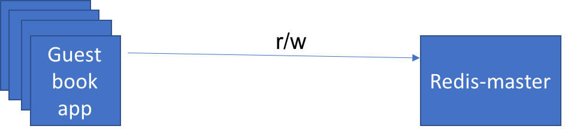
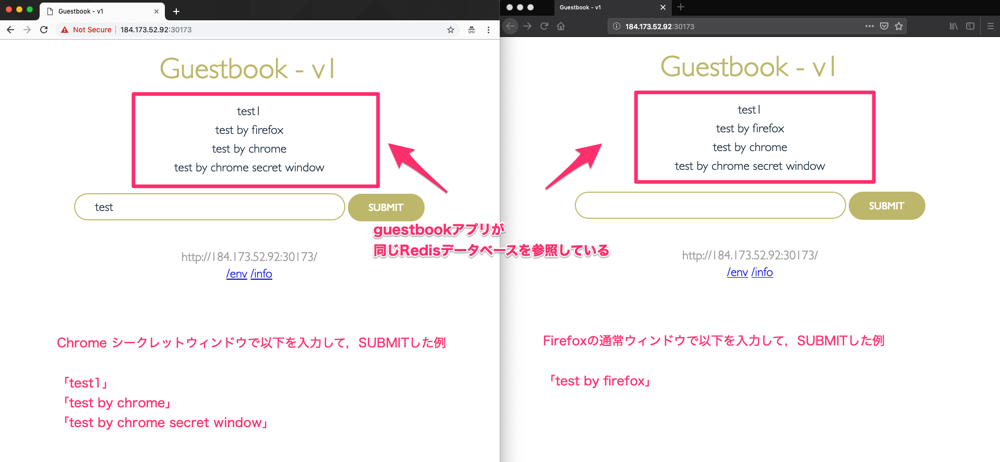

# Lab 3) マニフェストファイルの使用とRedisデータベースコンテナとの連携
Lab 1，2で使用してきた`guestbook`アプリケーションと同じものを使用します。
これまでとの違いは，`kubectl run`コマンドなどで直接Podを作成・開始するのではなく，マニフェストファイル(構成ファイル)を使用してアプリケーションのデプロイを行う点です。

Kubernetesのコントローラーがマニフェストファイルの記述内容のステート(状態)に寄せていく「**宣言的** かつ，よりきめ細やかなりソース管理」をシンプルに実現できます。これがKubernetesを利用する最大の理由と言っても過言ではありません。

Lab 3では大きく以下の2つを体験します。

- **1. マニフェストファイルを使用したアプリケーションのデプロイとスケーリング**
- **2. Redisコンテナを追加起動してguestbookアプリケーションと連携**

## 0. 事前準備 (リポジトリのクローン)
まずはアプリケーションをGitHubからクローンして，該当ディレクトリに移動してください。
複数バージョンのguestbookアプリケーションをKubernetes上にデプロイするためのマニフェストファイル(yaml)を配置しています。

```bash
マニフェストファイル群が用意されているリポジトリのクローンと，ディレクトリ移動

$ git clone https://github.com/capsmalt/guestbook.git
$ cd guestbook/v1
```

## 1. マニフェストファイルを使用したアプリケーションのスケーリング
ここで実施する作業自体は3ステップです。

- `guestbook-deployment.yaml` を使って `guestbook-v1`という名前のdeploymentを作成する (replicas=3 指定済)
- `guestbook-deployment.yaml` を編集して `3台構成`から`5台構成`にスケーリングさせる
- `guestbook-service.yaml` を使って `guestbook` という名前のserviceを作成する


上記自体は，コマンドを数回叩けば終わります。
この章では，yamlファイルの中身について目を通して，マニフェストファイルがどんなものか理解してください。

### まずは，guestbookアプリケーションのdeploymentの構成を見てみましょう。

1. **guestbook/v1/guestbook-deployment.yaml**  を任意のエディタで開きます。  


  ```yaml
  apiVersion: apps/v1
  kind: Deployment
  metadata:
    name: guestbook-v1
    labels:
      app: guestbook
      version: "1.0"
  spec:
    replicas: 3
    selector:
      matchLabels:
        app: guestbook
    template:
      metadata:
        labels:
          app: guestbook
          version: "1.0"
      spec:
        containers:
        - name: guestbook
          image: ibmcom/guestbook:v1
          ports:
          - name: http-server
            containerPort: 3000
  ```

  上記の構成ファイルは，`guestbook-v1`という名前のdeploymentオブジェクトを作成します。同時に`ibmcom/guestbook:v1`イメージを動作させる1つのコンテナを含むPodを作成します。この構成ファイルによって，`replicas: 3` と指定されるため，Kubernetesは少なくとも3つのアクティブなPodが動作し続けるように試みます。

  >補足:  
  > Kubernetesオブジェクトを作成する際には，yaml内で`apiVersion`や`kind`，`metadata`，`name`，`labels`，`namespace`などを指定できます。今回のようにdeploymentオブジェクトを生成する際は`kind: Deployment`のように指定します。他にも`Service`や`Pod`，`ConfigMap`，その他Kubernetesリソースの種類を指定することでマニフェストファイルから各種オブジェクトを作成できます。Deployment定義の場合は，`spec: `にレプリカ数や，使用するコンテナイメージ，ポートなどを指定しています。


2. guestbookのdeploymentオブジェクトの作成します。  

  マニフェストファイルを使用してdeploymentをします。

  実行例:

  ```bash
  $ kubectl create -f guestbook-deployment.yaml
  deployment.apps/guestbook-v1 created
  ```

3. ラベル(`label`)が `app=guestbook` であるPod一覧を表示します。  
  生成済の全てのPodの中から，labelが "app" で，その値が "guestbook" であるPodを一覧表示することが可能です。
  labelは，マニフェストファイル(yaml)内の `spec.template.metadata.labels` という項目の値を指します。

  実行例:

  ```bash
  $ kubectl get pods -l app=guestbook
  NAME                           READY   STATUS    RESTARTS   AGE
  guestbook-v1-7fc76dc46-dcjwg   1/1     Running   0          18m
  guestbook-v1-7fc76dc46-f7tzx   1/1     Running   0          18m
  guestbook-v1-7fc76dc46-zgckk   1/1     Running   0          18m
  ```

### マニフェストファイルのレプリカ数を編集してPodをスケーリングさせてみましょう。

4. マニフェストファイルを変更してみましょう。

  **guestbook/v1/guestbook-deployment.yaml** を任意のエディタで開いて `spec.replicas` の値を `replicas: 5` に変更します。

  ```yaml
  spec:
    replicas: 5
    selector:
      matchLabels:
        app: guestbook
  ```

5. 変更を反映させます。

  実行例:

  ```bash
  $ kubectl apply -f guestbook-deployment.yaml
  Warning: kubectl apply should be used on resource created by either kubectl create --save-config or kubectl apply
  deployment.apps/guestbook-v1 configured
  ```
6. 再度，Pod一覧を表示します。

  実行例:

  ```bash
  $ kubectl get pods -l app=guestbook
  NAME                           READY   STATUS    RESTARTS   AGE
  guestbook-v1-7fc76dc46-592gm   1/1     Running   0          1m
  guestbook-v1-7fc76dc46-dcjwg   1/1     Running   0          26m
  guestbook-v1-7fc76dc46-f7tzx   1/1     Running   0          26m
  guestbook-v1-7fc76dc46-k7nnq   1/1     Running   0          1m
  guestbook-v1-7fc76dc46-zgckk   1/1     Running   0          26m
  ```

  >補足1:  
  > マニフェストファイルを使用してdeploymentオブジェクトを生成することができました。今回はレプリカ数を増加させる変更を行いましたが，マニフェストファイル自体をバージョン管理することで，ある時点での状態をいつでも再現できることが分かるかと思います。Kubernetesでは基本的には全てのK8sリソースをマニフェストファイルを使用することで管理できます。一方で，各K8sリソースタイプごとに管理していくことの複雑さや手間の問題も指摘されています。この問題の解決策としてHelmやKustomize，Kssonetなど様々なツールを活用している事例もありますので，興味のある方はぜひ調査してみてください。
  > 
  >補足2:  
  > `kubectl edit` で直接編集することもできます。
  > ```bash
  > $ kubectl edit deployment guestbook-v1
  > 
  > "replicas: 3" のように変更しても良いです。
  > 未編集の場合は，":q"で終了。
  > 変更を加えた場合は，":wq"で保存するか，":q!"で変更をキャンセルします。
  > ```
  > 変更している場合は， `$ kubectl get pods -l app=guestbook` で確認してみましょう。
  > K8sが状態変更を適用させるべく，Podのインスタンスを増減させている様子が見れるはずです。
  > 
  > 実行例:
  > ```bash
  > $ kubectl get pods -l app=guestbook
  > NAME                           READY   STATUS        RESTARTS   AGE
  > guestbook-v1-7fc76dc46-592gm   0/1     Terminating   0          3m
  > guestbook-v1-7fc76dc46-dcjwg   1/1     Running       0          28m
  > guestbook-v1-7fc76dc46-f7tzx   1/1     Running       0          28m
  > guestbook-v1-7fc76dc46-k7nnq   0/1     Terminating   0          3m
  > guestbook-v1-7fc76dc46-zgckk   1/1     Running       0          28m
  > 
  > 少しだけ間を置いてから再度実行します。
  > 
  > $ kubectl get pods -l app=guestbook
  > NAME                           READY   STATUS    RESTARTS   AGE
  > guestbook-v1-7fc76dc46-dcjwg   1/1     Running   0          29m
  > guestbook-v1-7fc76dc46-f7tzx   1/1     Running   0          29m
  > guestbook-v1-7fc76dc46-zgckk   1/1     Running   0          29m
  > ```
  > 上記の例のようにレプリカ数3の状態になったことが確認できるはずです。


### 次に，guestbokアプリケーションのserviceの構成を見てみましょう。

7. **guestbook/v1/guestbook-service.yaml**  を任意のエディタで開きます。  

  ```yaml
  apiVersion: v1
  kind: Service
  metadata:
    name: guestbook
    labels:
      app: guestbook
  spec:
    ports:
    - port: 3000
      targetPort: http-server
    selector:
      app: guestbook
    type: NodePort
  ```

上記の構成では，`guestbook`という名前のserviceオブジェクトを作成します。Serviceはアプリケーションに対するトラフィックのためのネットワークパスを作成する際に使われます。今回はクラスター上の`3000番ポート`からのルートをアプリケーションの `http-serverポート` に指定します。

8. `guestbook-v1`deploymentを作成した時と同じコマンドを使って，`guestbook-service`serviceを作成しましょう。

  実行例:

  ```bash
  $ kubectl create -f guestbook-service.yaml
  service/guestbook created
  ```
  
9. ブラウザ上で以下のURLからguestbookアプリの動作をテストします。

    ブラウザで`<Public IP>:<NodePort>`を開きます。
    
    >補足:  
    > ワーカーノードの `Public IP` は以下のように確認します。
    > ```
    > $ ibmcloud cs workers mycluster
    > OK
    > ID                                                 Public IP       Private IP      Machine Type   State    Status   Zone    Version
    > kube-hou02-pa705552a5a95d4bf3988c678b438ea9ec-w1   184.173.52.92   10.76.217.175   free           normal   Ready    hou02   1.10.12_1543
    > ```
    > `NodePort` は以下のように確認します。
    > ```
    > $ kubectl get service guestbook
    > NAME        TYPE       CLUSTER-IP       EXTERNAL-IP   PORT(S)          AGE
    > guestbook   NodePort   172.21.180.240   <none>        3000:30173/TCP   3m
    > ```
    > 上記の出力例の場合の `<Public IP>:<NodePort>`は，次のようになります。
    > - Public IP: `184.173.52.92`
    > - NodePort: `30173`
    > 
    > したがって，ブラウザ上で `184.173.52.92:30173` にアクセスするとアプリケーションが開きます。

    guestbook アプリの "v1" が動作していることを確認してください。
    
    

以上の操作で，マニフェストファイル(yaml)で`deployment(guestbook-v1)`と`service(guestbook)`をKubernetes上に展開し，外部からアクセス可能なguestbookアプリケーションを動作させることができました。またyamlを編集することで，K8sが`desired state (宣言的に指定した状態)`を維持させるように動作することを確認できました。


## 2. Redisコンテナを追加起動してguestbookアプリケーションと連携

`guestbook/v1/guestbook`配下のguestbookアプリケーションのソースコードを見ると，多様なデータストアをサポートしていることがわかります。
デフォルトではメモリ上でguestbookエントリのログを保持する構成になっています。これはテスト目的であれば問題ない構成ですが，アプリケーションをスケールさせるような実働環境では上手く機能しない場合が多いかと思います。

この問題を解決するために，アプリケーションの全インスタンス間で同じデータストアを共有できる必要があります。今回はRedisデータベースをK8sクラスターにデプロイして使用します。Redisインスタンスはguestbookと似たような構成で定義します。

目指す構成イメージは以下です。




ここで実施する作業自体は4ステップです。

- `redis-master-deployment.yaml` を使って `redis-master`という名前のdeploymentを作成する
- `redis-master-service.yaml` を使って `redis-master`という名前のserviceを作成する
- 複数のguestbookアプリケーションが同一のRedisデータベースを使うことで永続化できることを確認する
- `redis-slave` という名前のRedisデータベースを追加して，読み/書きの役割を複数のRedisで使い分けるように構成する

### Redis Masterデータベースのdeploymentを作成しましょう。

1. redis-masterデータベースのdeploymentの構成を見てみましょう。

  **redis-master-deployment.yaml**  を任意のエディタで開きます。  

  ```yaml
  apiVersion: apps/v1
    kind: Deployment
  metadata:
    name: redis-master
    labels:
      app: redis
      role: master
  spec:
    replicas: 1
    selector:
      matchLabels:
        app: redis
        role: master
    template:
      metadata:
        labels:
          app: redis
          role: master
      spec:
        containers:
        - name: redis-master
          image: redis:2.8.23
          ports:
          - name: redis-server
            containerPort: 6379
  ```

  このyamlは，'redis-master' という名前のDeploymentでRedisデータベースを作成します。シングルインスタンスとして作成するので，レプリカ数を1にセットします。guestbookアプリケーションはRedisに接続しデータを永続化します。コンテナイメージは，'redis:2.8.23' を使用し，デフォルトのRedisポート番号である6379番で公開します。

2. Redis MasterデータベースのDeploymentを作成します。

  実行例:

  ```bash
  $ kubectl create -f redis-master-deployment.yaml
  deployment.apps/redis-master created
  ```

3. Redis MasterデータベースのPod動作を確認します。

  実行例:

  ```bash
  $ kubectl get pods -l app=redis,role=master
  NAME                            READY   STATUS    RESTARTS   AGE
  redis-master-5d8b66464f-qjjfn   1/1     Running   0          32s
  ```

4. スタンドアローン動作するRedis Masterデータベースをテストします。

  3.で確認したPod名(上記例では`redis-master-5d8b66464f-qjjfn`)を引数に指定してコマンド実行しコンテナ内に入って操作します。

  実行例:   
  
  ```bash
  $ kubectl exec -it redis-master-5d8b66464f-qjjfn redis-cli
  127.0.0.1:6379> ping
  PONG
  127.0.0.1:6379> exit
  ```
  >補足:  
  > `kubectl exec -it POD(正確には1つのコンテナ) COMMAND`コマンドは指定されたコンテナ内でプロセスを動作させる際に使用できます。
  > 今回は，`redis-master-5d8b66464f-qjjfn`というPODのコンテナ内で`redis-cli`コマンドを実行しました。さらにコンテナ内でコマンド実行することでRedisデータベースが正常動作しているかを確認しています。
  > 今回の例では，正常なら`ping`に対して`PONG`とレスポンスを返してくれる仕組みを使って確認しています。

### guestbookアプリケーションからRedis Masterデータベースに接続できるようにserviceを公開しましょう。

5. Redis Masterデータベースのserviceの構成を見てみましょう。

  **redis-master-service.yaml**  を任意のエディタで開きます。  

  ```yaml
  apiVersion: v1
  kind: Service
  metadata:
    name: redis-master
    labels:
      app: redis
      role: master
  spec:
    ports:
    - port: 6379
      targetPort: redis-server
    selector:
      app: redis
      role: master
  ```

  このyamlは，`redis-master`という名前のserviceを作成し，`6379番ポート`で外部公開します。さらに，`app=redis`と`role=master`のラベルが指定されたPodをターゲットにルーティングするように構成します。


6. Redis Masterデータベースを外部公開するServiceを作成します。

  実行例:

  ```bash
  $ kubectl create -f redis-master-service.yaml
  service/redis-master created
  ```

7. guestbookアプリケーションがRedis Masterデータベースを発見できるようにguestbookアプリを再起動します。

  実行例:

  ```bash
  $ kubectl delete deployment guestbook-v1
  deployment.extensions "guestbook-v1" deleted
  
  $ kubectl create -f guestbook-deployment.yaml
  deployment.apps/guestbook-v1 created
  ```

8. ブラウザ上で以下のURLからgurstbookアプリの動作をテストします。

  ブラウザで`<Public IP>:<NodePort>`を開きます。
    
  >補足:  
  > これまでのハンズオンと同様に以下の手順で `Public IP`と`NodePort`の情報を取得できます。
  > ワーカーノードの `Public IP` は以下のように確認します。
  > ```
  > $ ibmcloud cs workers mycluster
  > OK
  > ID                                                 Public IP       Private IP      Machine Type   State    Status   Zone    Version
  > kube-hou02-pa705552a5a95d4bf3988c678b438ea9ec-w1   184.173.52.92   10.76.217.175   free           normal   Ready    hou02   1.10.12_1543
  > ```
  > `NodePort` は以下のように確認します。
  > ```
  > $ kubectl get service guestbook
  > NAME        TYPE       CLUSTER-IP       EXTERNAL-IP   PORT(S)          AGE
  > guestbook   NodePort   172.21.180.240   <none>        3000:30173/TCP   3m
  > ```
  > 上記の出力例の場合の `<Public IP>:<NodePort>`は，次のようになります。
  > - Public IP: `184.173.52.92`
  > - NodePort: `30173`
  > 
  > したがって，ブラウザ上で `184.173.52.92:30173` にアクセスするとアプリケーションが開きます。

  guestbook アプリの "v1" が動作していることを確認してください。

   

### 複数のguestbookアプリケーションが同一のRedisデータベースを使うことで永続化できることを確認しましょう

9. もう一つブラウザを立上げてguestbookアプリの動作させてテストします。

  複数のブラウザ同じguestbookアプリケーションを動作させる必要があります。
  例えば以下のいずれかの方法で試してみましょう。
  
  - 通常ブラウザ と シークレットウィンドウ
  - Firefox と Chrome
  - etc.
  
  複数のブラウザでguestbookアプリケーションを開いたら， それぞれのブラウザ上で **フォームに任意の文字列を入力** します。
  
  以下の図は，Chromeのシークレットウィンドウと，Firefoxを使用した場合の例です。
  
  

  - 任意のブラウザで文字列を入力する
  - 複数のブラウザでページを更新する
  - 同じ入力情報が確認できる
  
  上記の動作を確認できたと思います。全てのPodインスタンスが同一のパーシスタンスストレージに書き込み，全てのインスタンスはguestbookエントリを表示するために同じストレージから読み出しています。つまり，guestbookアプリケーションが同一のRedisデータベースを指していることが分かります。データの永続化ができたことで，トラフィック増に応じてスケールするシンプルな3層アプリケーションを実現できました。


### `redis-slave` という名前のRedisデータベースを追加して，読み/書きの役割を複数のRedisで使い分けるように構成する

永続化データベースを使用できるようになりましたが，一般的に言われる主なボトルネックは，各リクエストを処理するデータベース・サーバーを一つしか持っていないことです。そこでシンプルな解決策を実施してみましょう。解決策の一つは， **読み/書き用に異なるデータベースを用いて分離することでデータ一貫性を満たす** 方法です。

`redis-slave`という名前のDeploymentを作成し，データの読み(read)を管理するredisデータベースとして動作させます。
スケーリングに対応する際は，`redis-slave`を複数インスタンス用意することで，データベースへのリクエストを捌けるようにします。

目指す構成イメージは以下です。


10. Redis slaveのdeploymentの構成見てみましょう。

  **redis-slave-deployment.yaml**  を任意のエディタで開きます。  

  ```yaml
  apiVersion: apps/v1
  kind: Deployment
  metadata:
    name: redis-slave
    labels:
      app: redis
      role: slave
  spec:
    replicas: 2
    selector:
      matchLabels:
        app: redis
        role: slave
    template:
      metadata:
        labels:
          app: redis
          role: slave
      spec:
        containers:
        - name: redis-slave
          image: kubernetes/redis-slave:v2
          ports:
          - name: redis-server
            containerPort: 6379
  ```

  `spec.replicas: 2`の記載があり,2つのレプリカを動作するように構成されていることが分かります。


11. Redis Slaveデータベースのdeploymentを作成します。

  実行例:

  ```
  $ kubectl create -f redis-slave-deployment.yaml
  deployment.apps/redis-slave created
  ```

12. Redis Slaveデータベースの全てのPodが動作しているか確認します。

  実行例:

  ```bash
  $ kubectl get pods -l app=redis,role=slave
  NAME                           READY   STATUS    RESTARTS   AGE
  redis-slave-586b4c847c-kj4q9   1/1     Running   0          1m
  redis-slave-586b4c847c-lw5gj   1/1     Running   0          1m
  ```

13. Redis SlaveのいずれかのPodのコンテナ内に入り，データベースを正しく閲覧できるか確認します。

  12.で確認したPod名のうち1つ選択して(上記例では`redis-slave-586b4c847c-kj4q9`)を引数に指定してコマンド実行しコンテナ内に入って操作します。

  実行例:

  ```bash
  $ kubectl exec -it redis-slave-586b4c847c-kj4q9 redis-cli
  127.0.0.1:6379> keys *
  1) "guestbook"
  127.0.0.1:6379> lrange guestbook 0 10
  1) "test1"
  2) "test  by firefox"
  3) "test by chrome"
  4) "test by chrome secret window"
  127.0.0.1:6379> exit
  ```

  手順9.で入力した文字列が格納されていて，正常に接続できていることが確認できます。

14. Redis Slaveデータベースを外部公開するためのServiceの構成を見てみましょう。

  **redis-slave-service.yaml**  を任意のエディタで開きます。  

  ```yaml
  apiVersion: v1
  kind: Service
  metadata:
    name: redis-slave
    labels:
      app: redis
      role: slave
  spec:
    ports:
    - port: 6379
      targetPort: redis-server
    selector:
      app: redis
      role: slave
  ```

15. guestbookアプリからRedis Slaveデータベースに接続するためのServiceを作成します。

  ```
  $ kubectl create -f redis-slave-service.yaml
  service/redis-slave created
  ```

16. guestbookアプリケーションがRedis Slaveデータベースを発見できるようにguestbookアプリを再起動します。

  実行例:

  ```bash
  $ kubectl delete deploy guestbook-v1
  deployment.extensions "guestbook-v1" deleted
  
  $ kubectl create -f guestbook-deployment.yaml
  deployment.apps/guestbook-v1 created
  ```

17. ブラウザ上で以下のURLからgurstbookアプリの動作をテストします。

  ブラウザで`<Public IP>:<NodePort>`を開きます。


以上でLab3のハンズオンは完了です。

最後に，**Lab3で作成したK8sリソースを以下のコマンドを削除** します。

  ```bash
  各種Deployment/Serviceを削除する
  1) guestbookアプリケーション
  $ kubectl delete -f guestbook-deployment.yaml
  $ kubectl delete -f guestbook-service.yaml

  2) Redis Slaveデータベース
  $ kubectl delete -f redis-slave-service.yaml
  $ kubectl delete -f redis-slave-deployment.yaml 

  3) Redis Masterデータベース
  $ kubectl delete -f redis-master-service.yaml 
  $ kubectl delete -f redis-master-deployment.yaml
  ```

次のハンズオンはこちら [Lab4](../Lab4/README.md) です。
