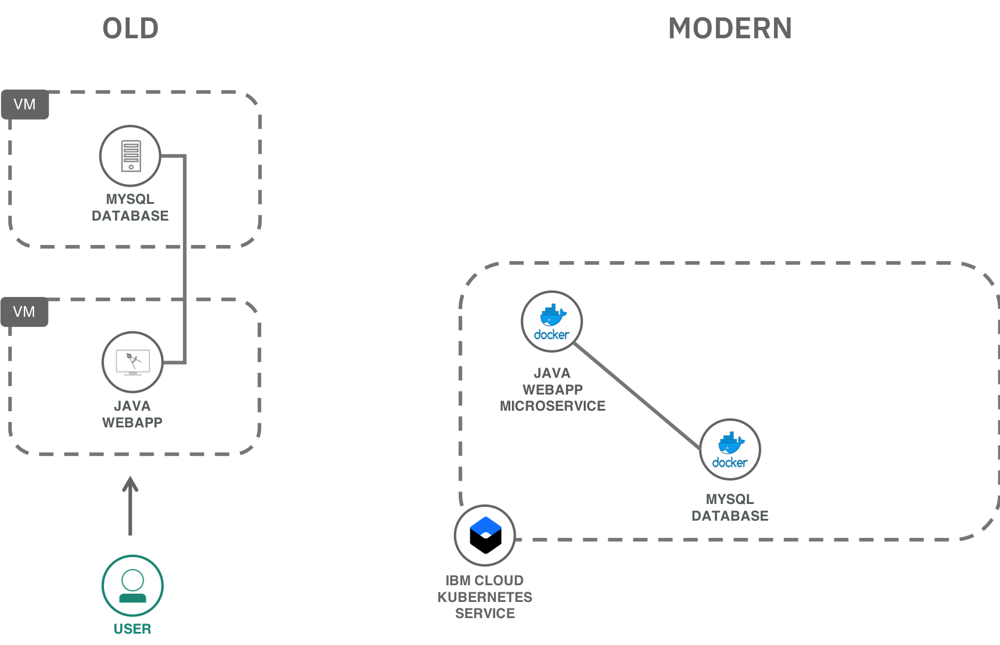
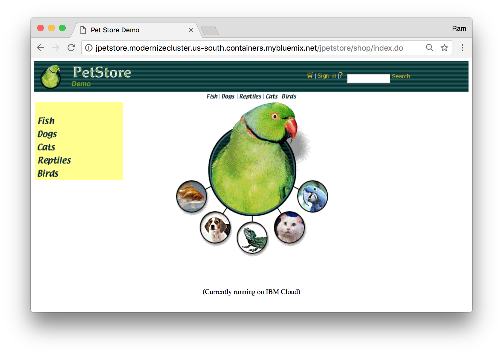

# Lab4) Helmチャートを使用したアプリケーションのデプロイ

Lab4では、Kubernetesのパッケージング技術の1つである [Helm](https://helm.sh/) を利用したデプロイの方法を学びます。

1. レガシーなJava（J2EE）のWebアプリケーションであるJPetStoreをDockerコンテナ化（ハンズオンでは実施しません）
2. Helmを利用して [IBM Cloud Kubernetes Service](https://www.ibm.com/cloud/container-service) にデプロイ



## ソースコードの入手
Lab4，5に使用するリポジトリをクローンします:

```bash
$ git clone https://github.com/kissyyy/jpetstore-kubernetes
$ cd jpetstore-kubernetes
```

#### フォルダーの構成
クローンしたリポジトリは以下のファイルから構成されています。

| フォルダー | 説明 |
| ---- | ----------- |
|[**jpetstore**](https://github.com/kissyyy/jpetstore-kubernetes/jpetstore)| Javaでかかれたペットショップのアプリケーション |
|[**mmssearch**](https://github.com/kissyyy/jpetstore-kubernetes/mmssearch)| GOで実装された画像認識機能付きチャットアプリ |
|[**helm**](https://github.com/kissyyy/jpetstore-kubernetes/helm)| KubernetesにデプロイするためのHelm チャート |
|[**pet-images**](https://github.com/kissyyy/jpetstore-kubernetes/pet-images)| チャットアプリの動作確認用の動物画像ファイル |

## 既存アプリケーションのコンテナ化
Lab4では既に公開済みのPublic Imageを利用します。
そのため以下の操作は実施する必要はありませんが興味のある方はぜひ試してみてください。

（時間があったら書きます）

## アプリケーションのデプロイ

### Helmを利用したデプロイ
Helmは、Kubernetesのパッケージ・マネージャーです。 Helm チャートと呼ばれる定義ファイルを使用して、Kubernetes アプリケーションの定義やインストール、アップグレードを行うことができます。

JpetStoreをデプロイするためのHelmチャートは以下のようなフォルダ構造になっています。

```bash
modernpets
├── Chart.yaml
├── templates
│   ├── NOTES.txt
│   ├── _helpers.tpl
│   ├── deployment.yaml
│   └── service.yaml
└── values.yaml

1 directory, 6 files
```

まずHelmの初期化を実施します。

```bash
$ cd helm

# Helm 初期化
$ helm init
$HELM_HOME has been configured at /Users/XXXXX/.helm.

Tiller (the Helm server-side component) has been installed into your Kubernetes Cluster.
Happy Helming!
```

初期化が完了したらJpetStoreアプリをデプロイします。

```bash
# JPetstoreアプリをインストール
$ helm install --name jpetstore ./modernpets
NAME:   jpetstore
LAST DEPLOYED: Wed Feb 13 19:38:29 2019
NAMESPACE: default
STATUS: DEPLOYED

RESOURCES:
==> v1beta2/Deployment
NAME                               KIND
jpetstore-modernpets-jpetstoreweb  Deployment.v1beta2.apps

==> v1beta1/Deployment
NAME                              DESIRED  CURRENT  UP-TO-DATE  AVAILABLE  AGE
jpetstore-modernpets-jpetstoredb  1        1        1           0          1s

==> v1/Service
NAME  CLUSTER-IP      EXTERNAL-IP  PORT(S)       AGE
web   172.21.189.80   <nodes>      80:32480/TCP  1s
db    172.21.194.157  <none>       3306/TCP      1s


NOTES:
Get Cluster Public IP Adress:
$ ibmcloud cs workers mycluster
```

JpetStoreアプリがデプロイされました。

### 補足: YAMLファイルを使用したデプロイ

Lab3までと同様、yamlファイルを使用してデプロイすることも可能です。
yamlファイルでデプロイをする場合は以下のようになります。

```bash
#jpetstore-kubernetes/jpetstore ディレクトリに移動
$ cd jpetstore

$ kubectl apply -f jpetstore.yaml
deployment.extensions "jpetstoreweb" created
service "web" created
deployment.extensions "jpetstoredb" created
service "db" created
```

JpetStoreのWebコンテナとDBコンテナがデプロイされます。

```bash
$ kubectl get all
NAME                            READY     STATUS    RESTARTS   AGE
jpetstoredb-5fd4df446d-pm79t    1/1       Running   0          33s
jpetstoreweb-5f7c96bc8b-957nf   1/1       Running   0          33s
jpetstoreweb-5f7c96bc8b-hz4ql   1/1       Running   0          33s

NAME         TYPE        CLUSTER-IP      EXTERNAL-IP   PORT(S)        AGE
db           ClusterIP   172.21.206.30   <none>        3306/TCP       32s
kubernetes   ClusterIP   172.21.0.1      <none>        443/TCP        1h
web          NodePort    172.21.0.235    <none>        80:31231/TCP   33s

NAME           DESIRED   CURRENT   UP-TO-DATE   AVAILABLE   AGE
jpetstoredb    1         1         1            1           33s
jpetstoreweb   2         2         2            2           33s

NAME                      DESIRED   CURRENT   READY     AGE
jpetstoredb-5fd4df446d    1         1         1         33s
jpetstoreweb-5f7c96bc8b   2         2         2         33s
```

## 動作確認

ブラウザ上で以下のURLからjpetアプリの動作をテストします:
`<クラスターのPublic IP>:<ポート>`にアクセスしてください。

> クラスターのPublic IPは`ibmcloud cs workers mycluster`から取得します。

   

以上でLab4は終了です。  
最後のハンズオンは[Lab5](../Lab5/README.md)です。
