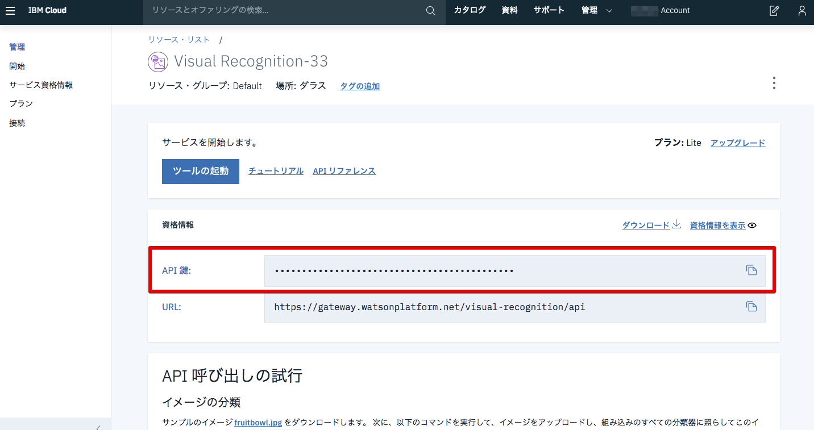

# Lab5: Watson APIを使ったアプリケーションのデプロイ

このLabではクラウドサービスや外部APIをKubernetesから呼び出す方法について学びます。

## つくるもの

Lab4ではWebとDBから構成されるレガシーなJavaアプリケーションをコンテナ化し、Kubernetesにデプロイしました。これにより、既存のアプリケーションがモダナイズできたことになります。
このLab5ではモダナイズされたアプリを拡張し、新しい機能をマイクロサービスとして実装します。

`mmssearch`は画像認識の機能をもったチャットアプリケーションです。
画像認識にはIBM Cloudの画像認識サービス([Watson Visual Recognition](https://www.ibm.com/watson/services/visual-recognition/))を使用します。


## Visual Recognitionサービスの作成

ブラウザで [IBM Cloudのカタログページ](https://cloud.ibm.com/catalog/) にアクセスし、「AI」カテゴリにある「Visual Recognition」を選択します。


デフォルトでサービスを作成する地域が「ダラス(Dallas)」、サービスプランは「ライト（Lite）」となっています。
「作成」をクリックしてサービスインスタンスを作成します。


サービスが作成されると画面が遷移し、サービスの詳細画面が表示されます。「管理」画面に遷移すると、API呼び出しをするために必要な**APIキー**が取得できます。このAPIキーはこの後使うので参照できるようにしておいてください。



## Kubernetes Secret の作成

Kubernetes上のアプリケーションから外部サービスを呼び出すための設定を行います。
外部サービスを呼び出すためにはAPIキーやユーザID/パスワードが必要となりますが、アプリケーションとは切り離して別の設定ファイルとして管理することが推奨されています。
Kubernetesで設定ファイルを管理する方法として`Configmap` と `Secret` の2種類がありますが、APIキーのようなより機密性のな情報については`Secret`を使用することが推奨されています。

テンプレートファイル**mms-secrets.json.template**を使用して、**mms-secrets.json** ファイルを作成します:

   ```bash
   # from jpetstore-kubernetes directory
   cd mmssearch

   cp mms-secrets.json.template mms-secrets.json
   ```

エディタで**mms-secrets.json** を開き、先ほど作成したVisual RecognitionのAPIキーを貼り付けます。

  （画像差し替え予定）


KuberenetesクラスターのSecretを生成します。

```bash
# mmssearchディレクトリに遷移
$ cd mmssearch

# Secretの生成
$ kubectl create secret generic mms-secret --from-file=mms-secrets=./mms-secrets.json
secret "mms-secret" created
```

`Secret`が正しく生成できているか確認します。

```bash
$ kubectl get secret mms-secret -o yaml
apiVersion: v1
data:
  mms-secrets: ewogICJ3YXRzb24iOgogIHsKICAgICJ1cmwiOiAiaHR0cHM6Ly9nYXRld2F5LndhdHNvbnBsYXRmb3JtLm5ldC92aXN1YWwtcmVjb2duaXRpb24vYXBpIiwKICAgICJub3RlIjogIkl0IG1heSB0YWtlIHVwIHRvIDUgbWludXRlcyBmb3IgdGhpcyBrZXkgdG8gYmVjb21lIGFjdGl2ZSIsCiAgICAiYXBpX2tleSI6IHJ4bk5ITFUyWm8yVlRTODJ1TUYzcDJRdzB0bkZHTkYyX002ZVJoc2hNNERmIgogIH0KfQo=
kind: Secret
metadata:
  creationTimestamp: 2019-02-13T11:26:41Z
  name: mms-secret
  namespace: default
  resourceVersion: "2472"
  selfLink: /api/v1/namespaces/default/secrets/mms-secret
  uid: 3c7bed61-2f82-11e9-ad89-9295e43053f2
type: Opaque
```

 >mms-secretのところにはランダムの文字列が並んでいますが、これはAPIキーがBase64 エンコードされているものです。
 >なお、Configmapとして生成した場合は暗号化されず平文のまま値が格納されます。

これで、Visual RecognitionのAPIキーがSecretとしてKubernetesクラスターに渡されました。
実際にアプリケーションから読み出す方法はSecretをVolumeとしてマウントする方法と、環境変数としてSecretを参照する方法があります。
今回のアプリでは以下のようにVolumeとしてマウントする方法で実装されています。

```yaml
    spec:
        volumeMounts:
         - name: service-secrets
           mountPath: "/etc/secrets"
           readOnly: true
      volumes:
      - name: service-secrets
        secret:
          secretName: mms-secret
          items:
          - key: mms-secrets
            path: mms-secrets.json
```

これにより`/etc/secret/mms-secrets.json`がマウントされます。

### 補足

IBM Cloudでは、KubernetesクラスターとIBM Cloudのサービスの接続を容易にするためのコマンドも用意されています。

```bash
ibmcloud ks cluster-service-bind mycluster default visual-recognition-xx
```

これを実行すると、`binding-<サービスインスタンス名>`という名前のsecretが生成されます。
ただし実行前にCFの組織とスペースを`ibmcloud target`で指定する必要があります。詳しくはリンクを参照してください。

なおこの場合`jpetstore-watson-nodeport.yaml`を変更する必要あります。

```yaml
    # 中略
    spec:
      containers:
      - name: mmssearch
        image: kissyyy/mmssearch
        ports:
        - containerPort: 8080
        env:
        - name: DB_LOCATION
          value: "tcp(db)/jpetstore"
        volumeMounts:
         - name: binding #変更
           mountPath: "/etc/secrets"
           readOnly: true
      volumes:
      - name: binding #変更
        secret:
          secretName: binding-vr-jpet #変更
          items:
          - key: binding #変更
            path: mms-secrets.json #変更するならmmssearch/main.goの記述を変更する
```

## アプリケーションのデプロイ

### Helmを利用したデプロイ

Helm チャートを使用してMMSSearch アプリをデプロイします。

```bash
# helmディレクトリーに遷移
$ cd ../helm

# MMSSearchアプリのデプロイ
$ helm install --name mmssearch ./mmssearch
NAME:   mmssearch
LAST DEPLOYED: Wed Feb 13 20:31:56 2019
NAMESPACE: default
STATUS: DEPLOYED

RESOURCES:
==> v1/Service
NAME       CLUSTER-IP    EXTERNAL-IP  PORT(S)         AGE
mmssearch  172.21.1.254  <nodes>      8080:31941/TCP  2s

==> v1beta2/Deployment
NAME                 KIND
mmssearch-mmssearch  Deployment.v1beta2.apps


NOTES:
iGet Cluster Public IP Adress:
$ ibmcloud cs workers mycluster
```

MMSSearchアプリがデプロイされました。

### YAMLファイルを使用したデプロイ

yamlファイルを使用してデプロイする場合は以下のようになります。

```bash
#jpetstore-kubernetes/jpetstore ディレクトリに移動
$ cd jpetstore

# MMSSearchアプリのデプロイ
$ kubectl apply -f jpetstore-watson.yaml
service "mmssearch" created
deployment.extensions "mmssearch" created
```

MMSSearchのコンテナがデプロイされます。

```bash
$ kubectl get all
NAME                            READY     STATUS              RESTARTS   AGE
jpetstoredb-5fd4df446d-pm79t    1/1       Running             0          21m
jpetstoreweb-5f7c96bc8b-957nf   1/1       Running             0          21m
jpetstoreweb-5f7c96bc8b-hz4ql   1/1       Running             0          21m
mmssearch-6bf55f59d6-sbk28      0/1       ContainerCreating   0          13s

NAME         TYPE        CLUSTER-IP       EXTERNAL-IP   PORT(S)          AGE
db           ClusterIP   172.21.206.30    <none>        3306/TCP         21m
kubernetes   ClusterIP   172.21.0.1       <none>        443/TCP          1h
mmssearch    NodePort    172.21.207.171   <none>        8080:30213/TCP   14s
web          NodePort    172.21.0.235     <none>        80:31231/TCP     21m

NAME           DESIRED   CURRENT   UP-TO-DATE   AVAILABLE   AGE
jpetstoredb    1         1         1            1           21m
jpetstoreweb   2         2         2            2           21m
mmssearch      1         1         1            0           13s

NAME                      DESIRED   CURRENT   READY     AGE
jpetstoredb-5fd4df446d    1         1         1         21m
jpetstoreweb-5f7c96bc8b   2         2         2         21m
mmssearch-6bf55f59d6      1         1         0         13s
```
> Lab4でデプロイしたJpetStoreアプリも含まれています。

## 動作確認

ブラウザ上で以下のURLからjpetアプリの動作をテストします:
`<クラスターのPublic IP>:<ポート>`にアクセスしてください。

[pet-images](https://github.com/kissyyy/jpetstore-kubernetes/pet-images)ディレクトリにある画像をアップロードすると、画像認識を行い、JpetStoreにある種類かどうかが返ってきます。

   

## お片付け

```bash
# Lab4, 5でデプロイした2つのアプリを削除します
$ helm delete jpetstore --purge
$ helm delete mmssearch --purge

# クラスターに保存されているSecretを削除します
$ kubectl delete secret mms-secret

```

以上でハンズオンは終了です。お疲れ様でした。