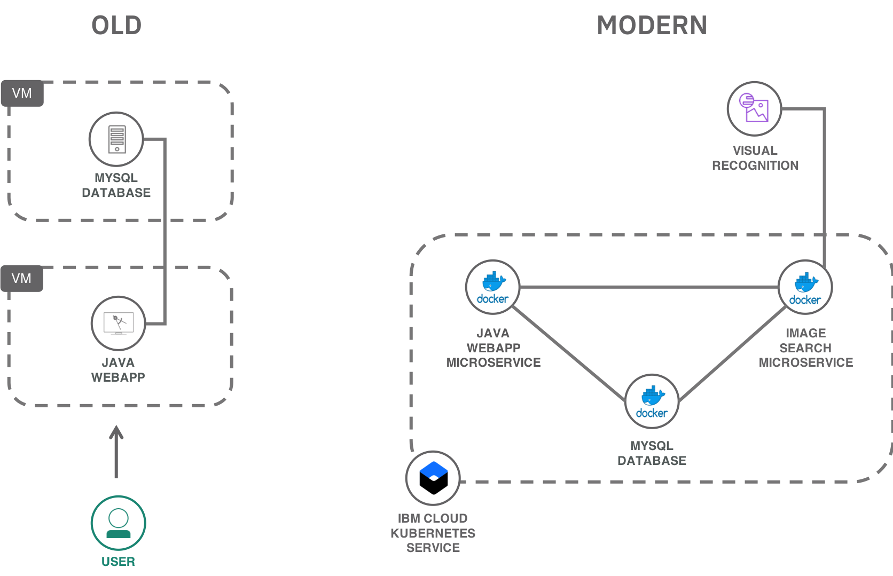
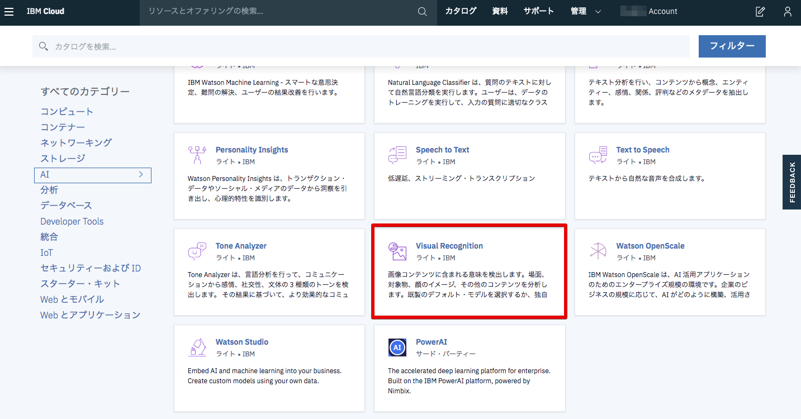
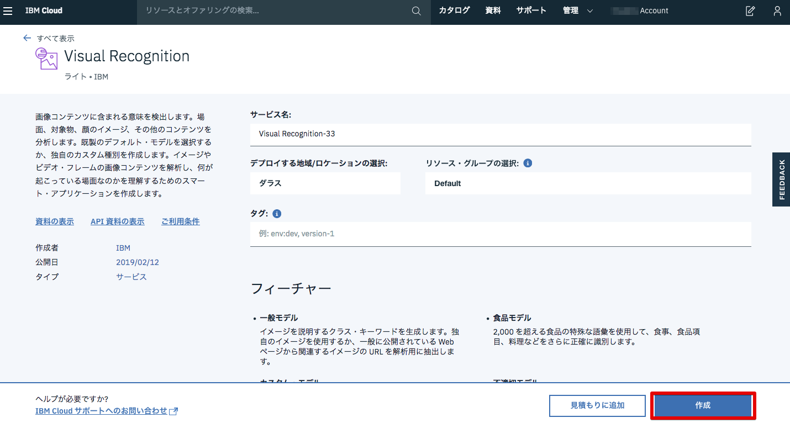
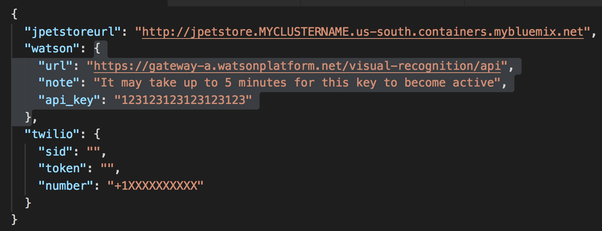
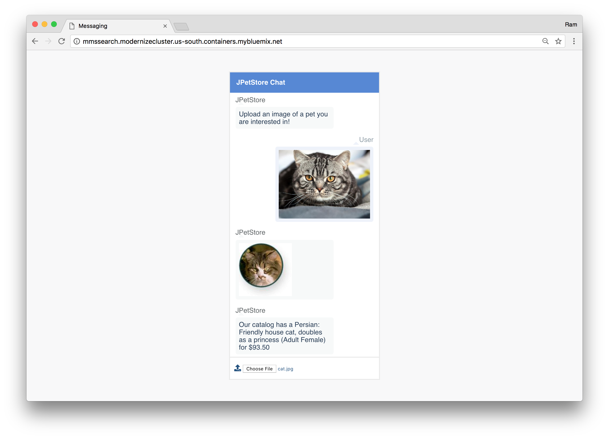

# Lab5: Watson APIを使ったアプリケーションのデプロイ

このLabではクラウドサービスや外部APIをKubernetesから呼び出す方法について学びます。

## つくるもの

Lab4ではWebとDBから構成されるレガシーなJavaアプリケーションをコンテナ化し、Kubernetesにデプロイしました。これにより、既存のアプリケーションがモダナイズできたことになります。
このLab5ではモダナイズされたアプリを拡張し、新しい機能をマイクロサービスとして実装します。

`mmssearch`は画像認識の機能をもったチャットアプリケーションです。
画像認識にはIBM Cloudの画像認識サービス([Watson Visual Recognition](https://www.ibm.com/watson/services/visual-recognition/))を使用します。



## Visual Recognitionサービスの作成

ブラウザで [IBM Cloudのカタログページ](https://cloud.ibm.com/catalog/) にアクセスし、Visual Recognitionサービスを作成します。



サービスを作成する地域は「ダラス(Dallas)」、サービスプランは「ライト（Lite）」を選択し、「作成」をクリックします。



サービスが作成されると画面が遷移し、サービスの詳細画面が表示されます。「管理」画面に遷移すると、API呼び出しをするために必要な**APIキー**が取得できます。このAPIキーはこの後使うのですぐに参照できるようにしておいてください。


## Kubernetes Secret の作成

Kubernetes上のアプリケーションから外部サービスを呼び出すための設定を行います。
外部サービスを呼び出すためにはAPIキーやユーザID/パスワードが必要となりますが、アプリケーションとは切り離して別の設定ファイルとして管理することが推奨されています。
Kubernetesで設定ファイルを管理する方法として`Configmap` と `Secret` の2種類がありますが、APIキーのようなより機密性のな情報についてはSecretを使用することが推奨されています。

テンプレートファイル**mms-secrets.json.template**を使用して、**mms-secrets.json** ファイルを作成します:

   ```bash
   # from jpetstore-kubernetes directory
   cd mmssearch

   cp mms-secrets.json.template mms-secrets.json
   ```

エディタで**mms-secrets.json** を開き、先ほど作成したVisual RecognitionのAPIキーを貼り付けます。

  （画像差し替え予定）



KuberenetesクラスターのSecretを生成します。

```bash
# from the jpetstore-kubernetes directory
cd mmssearch

kubectl create secret generic mms-secret --from-file=mms-secrets=./mms-secrets.json

出力
```

`Secret`が正しく生成できているか確認します。

```bash
kubectl get secret

出力
```

```bash
kubectl get secret mms-secret -o yaml

出力
```

 >mms-search欄にはランダムの文字列が並んでいますが、これはAPIキーがBase64 エンコードされているものです。
 >なお、Configmapとして生成した場合は暗号化されず平文のまま値が格納されます。

これで、Visual RecognitionのAPIキーがSecretとしてKubernetesクラスターに渡されました。
実際にアプリケーションから読み出す方法はSecretをVolumeとしてマウントする方法と、環境変数としてSecretを参照する方法があります。
今回のアプリでは以下のようにVolumeとしてマウントする方法で実装されています。

```yaml
    spec:
        volumeMounts:
         - name: service-secrets
           mountPath: "/etc/secrets"
           readOnly: true
      volumes:
      - name: service-secrets
        secret:
          secretName: mms-secret
          items:
          - key: mms-secrets
            path: mms-secrets.json
`
```

これにより`/etc/secret/mms-secrets.json`がマウントされます。

### 補足

IBM Cloudでは、KubernetesクラスターとIBM Cloudのサービスの接続を容易にするためのコマンドも用意されています。

```bash
ibmcloud ks cluster-service-bind mycluster default visual-recognition-xx
```

これを実行すると、`binding-<サービスインスタンス名>`という名前のsecretが生成されます。
ただし実行前にCFの組織とスペースを`ibmcloud target`で指定する必要があります。
詳しくはリンクを参照してください。


なおこの場合`jpetstore-watson-nodeport.yaml`を変更する必要あります。

```yaml
    spec:
      containers:
      - name: mmssearch
        image: kissyyy/mmssearch
        ports:
        - containerPort: 8080
        env:
        - name: DB_LOCATION
          value: "tcp(db)/jpetstore"
        volumeMounts:
         - name: binding #変更
           mountPath: "/etc/secrets"
           readOnly: true
      volumes:
      - name: binding #変更
        secret:
          secretName: binding-vr-jpet #変更
          items:
          - key: binding #変更
            path: mms-secrets.json #変更するならmmssearch/main.goの記述を変更する
```

## アプリケーションのデプロイ

### Helmを利用したデプロイ

Helm チャートを使用してMMSSearch アプリをデプロイします。

    ```bash
    # Change into the helm directory
    cd ../helm

    # Ceate the MMSSearch microservice
    helm install --name mmssearch ./mmssearch
    ```

    出力：

    ```bash
    NAME:   mmssearch-helm
    LAST DEPLOYED: Wed Feb 13 15:49:39 2019
    NAMESPACE: default
    STATUS: DEPLOYED

    RESOURCES:
    ==> v1/Service
    NAME       CLUSTER-IP      EXTERNAL-IP  PORT(S)         AGE
    mmssearch  172.21.216.131  <nodes>      8080:30293/TCP  1s

    ==> v1beta2/Deployment
    NAME                      KIND
    mmssearch-helm-mmssearch  Deployment.v1beta2.apps
    ```

### YAMLファイルを使用したデプロイ

yamlファイルを使用してデプロイする場合は以下のようになります。

```bash
kubectl apply -f jpetstore-watson.yaml
```

MMSSearchのコンテナがデプロイされます。

```bash
kubectl get all
```

## 動作確認


ブラウザ上で以下のURLからjpetアプリの動作をテストします:
`<クラスターのPublic IP>:<ポート>`にアクセスしてください。

`pet-images`ディレクトリにある画像をアップロードすると、画像認識を行い、JpetStoreにある種類かどうかが返ってきます。

   

## アプリの変更（余力があれば書きます）

mmssearch.go or index.htmlを変更し再度docker buildする。
ビルドはibmclodu cr buildで実行


## お片付け

```bash
# Use "helm delete" to delete the two apps
helm delete jpetstore --purge
helm delete mmssearch --purge

# クラスターに保存されているSecretを削除
kubectl delete secret mms-secret

```

以上でハンズオンは終了です。お疲れ様でした。